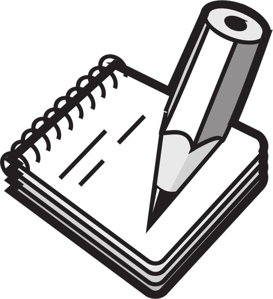

# Scribe Guidelines (U)

Undergraduates may earn up to 3 points for scribing lectures or project workshops/presentations. At present, I do not plan to have students scribe paper presentations, but if this turns out to be a lively class and there is demand, that may change. 

## Why scribe?

{: width="128px" style="float: right; padding-right: 16px;" }

In many classes, students copy down from the board what the professor writes...which come from the professor's notes. Why not just give students those notes? There are several objectives, including but not limited to: (1) controlling the rate of information flow, (2) ensuring each step is clear, allowing students to ask clarifying questions, and (3) encouraging students to engage with the material in detail, in real time. 

When you elect to scribe for this course, it means you will engage with the course material in a detailed, systematic fashion. Scribing is _not_ transcription; as a student, you should view scribing as part of a pedagogical toolkit. 

## How to scribe

Scribing should happen in two phases: during the first phase you will be taking contemporaneous notes and during the second phase you will write up your notes. 

### Phase 1: Taking notes

{: height="4px" style="float:left;"}

Taking notes is hard! It is especially challenging in classes that are discussion-based, where multiple people may be talking at once, and where conversations may happen at a much faster speed than lecture. When taking notes, **do not expect you will be able to participate at the same level of engagement as you would, were you not taking notes**. Do, however, feel empowered to **interrupt whenever you miss something**. 

#### Handwriting vs. Typing
**You are free to whatever medium for note-taking works best for you.** If you do not consider yourself to be a good note-taker, consider using scribing to try out different methods of note-taking to see what works best for you. 

_Anecdata:_ I, personally, have always struggled with note-taking. I never looked back at my notes and never understood the purpose. It was not until the middle of graduate school until I learned to take notes as a way that worked for me: I would just write what I heard and generally not look at what I was writing. This meant that early on I had a lot of typos and portions of my notes that were effectively illegible. Eventually, they started to look like [this](https://docs.google.com/document/d/1f8tcvQCVcS6pJ2qECe_mDsdsO4adbyKoNuE3FlUne9c/edit?usp=sharing). I also found it helpful to share my note document with someone as I was typing to help check my understanding live. You can see an example of this [here](https://docs.google.com/document/d/1At8G0OK6TngKrd7Owbq0rBRzAbSaxV97TvkC1zImjDA/edit?usp=sharing), where my then-advisor responded to my notes in real time. I will allow up to two students to scribe per-meeting; if you find that paired note-taking works well for you, feel free to employ this method.

#### On the use of recording devices

You may use recording devices to aid in your note-taking. **However, this is very likely to end up being more work than taking contemporaneous notes!** 

### Phase 2: Writing up notes

To reiterate: scribing is not transcription! While it is possible to take notes in a way that ends up differing very little from its final form, I expect most students to see a signficant change from their raw notes to the final version. 

Write-ups will be **due by 11:59pm on the day you scribe, throughout September.** The purpose of this deadline is twofold:

1. It ensures that you re-engage quickly.
2. It ensures that you don't spend a long time on write-ups.
3. It gives me time to give you feedback _during September_.

During September, I will be giving feedback on scribed notes _by 9am the next day_. You will have the opportunity to re-submit your notes after receiving feedback before 11:59pm on the _next day_ (i.e., the same day I submit feedback) to improve your grade.

In _October_, we will move to having notes due at 11:59pm on the _day after you scribe_. 

In summary:

* **September**: Suppose you take notes on a *Monday*. You must submit your notes that evening, by 11:59pm. I will provide feedback before 9:00am on _Tuesday_. If you score a 3, excellent! If you score lower than a 3, I will provide suggestions to improve your score. You can then choose to implement them and if you do, submit your revision by 11:59pm on _Tuesday_.
* **October**: Suppose you take notes on a _Monday_. Then you should submit your notes by 11:59pm on _Tuesday_. 

Note: _Late notes will not be accepted. There is **no grade penalty for not submitting your notes**. If you fail to submit your notes and do not have the usual documentation (i.e., medical or personal reasons), you will be de-prioritized for future scribing._

For what your final form should look like, see the section on [how you will be graded](#how-you-will-be-graded).

## How to submit your notes

There will be entries in Blackboard for you to submit your notes. Notes should be in pdf format, written in 

## How you will be graded